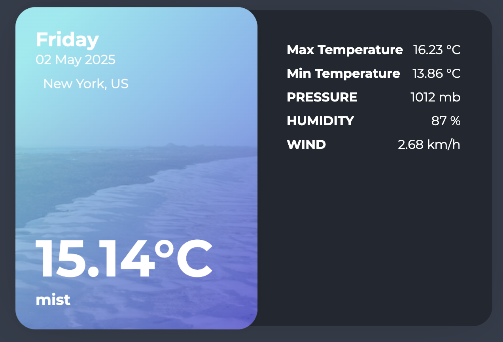

# 🌦️ Weather Fetcher — Symfony + Docker

A simple weather data fetcher built with **Symfony**, running inside **Docker**, using **OpenWeatherMap API**.

---

## 🚀 Quick Start

### 1. Clone the Repository

````BASH
git clone git@github.com:pavlovich-app/weather.git
cd weather
````

### 2. Set Your API Key
Create a .env.dev file and add your OpenWeatherMap API key:


````
OPENWEATHERMAP_API_KEY=your_api_key_here
````

### 3. Build Docker Images

````
docker compose build
````

### 4. Start the Application

````
docker compose up -d
````

Once started, the application will be available at:
👉 http://localhost:8000
or try http://127.0.0.1:8000



#☁️ Fetch Weather Data

###🔄 Fetch for All Cities
````
docker compose exec php php /var/www/weather/bin/console app:weather:fetch
````

###🏙️ Fetch for One City
````
docker compose exec php php /var/www/weather/bin/console app:weather:fetch Houston
````
If no city argument is provided, the command updates all predefined cities.

#🐳 Docker Notes

| Command | Description |
|--------|-------------|
| ```` docker compose build ```` | Build all services |
| ```` docker compose up -d ```` | Start containers in background |
| ```` docker compose down ```` | Stop and remove containers |
| ```` docker compose exec php bash ```` | Open shell in PHP container |
| ```` docker compose logs -f php ```` | View PHP container logs |


## ✅ What is tested

| Command | Description |
|--------|-------------|
| ````fetchWeatherForCity() ```` | Returns a `WeatherDTO` from a mocked source |
| ````getWeatherForCity() ```` | Returns `null` if there is nothing in the cache. Returns a `WeatherDTO` if data exists in the cache. |
| ````setWeatherToCache() ```` | Verifies that the cache is called with the correct arguments. |

---

## 🧪 How to run the test

```bash
./vendor/bin/phpunit tests/Service/WeatherServiceTest.php
````